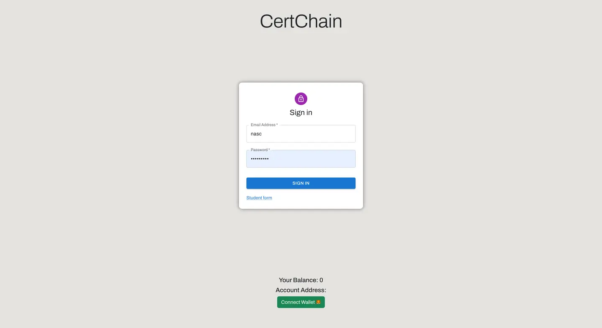

# CertChain

CertChain is a decentralized application (Dapp) built on the Ethereum Virtual Machine (EVM) to create and assign certificates to students as NFTs (Non-Fungible Tokens). This approach helps solve the issue of certificate fraud.



## Team Members

- [Saahil A. V.](https://github.com/STUDYHUB02)
- [Priyanshu Raj](https://github.com/aditiya-raj2004)
- [Vrashabha Nilajagi](https://github.com/vrashabha13)
- Shrutik Sai

## Tech Stack

|          |     |  |
| ----------------------------------------------------------------------------------------------------------- | --------------------------------------------------------------------------------------------------------------------- | ----------------------------------------------------------------------------------------------------------- |
|  |  |                 |
|              |                    |             |

## Run Locally

- Clone the repository

```bash
   git clone https://github.com/4rjunc/CertChain.git
```

- Change the directory

```bash
    cd CertChain
```

- Create .env

```env
AMOY = <add testnet link>
PRIVATE_KEY = <add wallet private key>
JWT = <token of pinnata>

```

- Install modules

```bash
    npm install
```

- Start the server

```bash
    npm run dev
```

## Docker

- Building image

```bash
docker bulit -t cert-chain .
```

- Run the container

```bash
docker run -p 3000:3000 cert-chain
```

This will create a Docker container running at
[http://localhost:3000/](http://localhost:3000/)
